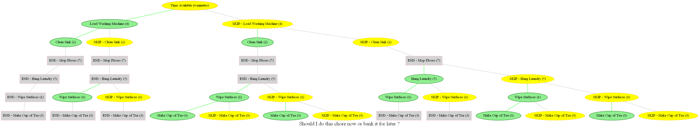

# Recursion & Graphviz

A repo to explore recursion using a real world example; a task list and a time limit, while learning to use Graphviz.

### Why does housework seem to take an eternity? 
Well, it's not just about the cleaning and tidying up! 
- Each chore is like a contestant in a game show of my own making called **'Should I Do This Now?'**. 
- Every task gets its moment on the stage, where I, the illustrious host, must decide: 'Do I tackle this chore now, or 'bank it for later'?' 
- So, you see, it's not _just cleaning_! – it's **strategic planning and time management**. 

## So when I decided to study recursion - household chores were the ideal place to start...

I have 6 minutes and several chores on my task list.
- How can I best use my time? - I need an algorythm to create the choices NOT an algorythm to make the decision for me. 
- And I need those choices displayed visually!

### My Solution
- Use recursion to find the possible options and display them using Graphviz
_Note: This requires Graphviz to be installed._
```
python recursion.py
```

Results:

