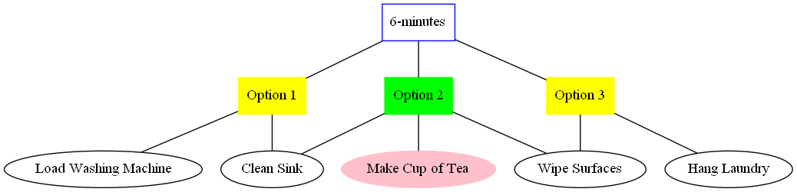

# Recursion & Graphviz

A repo to explore recursion using a real world example; a task list and a time limit, while learning to use Graphviz.

I have 6 minutes and several tasks on my task list.
- How can I best use my time? - I need an algorythm to create the choices NOT an algorythm to make the decision for me. 
- And I need those choices displayed visually!

### My Solution
- Use recursion to find the possible options
```
python recursion_tasklist.py
```
- Run the generated graphviz code
```
dot -Tpng outfile.gv -o taskgraph.png
```
_Note: This requires Graphviz to be installed._

Result:


The command line output shows the recursion process as it works through.
